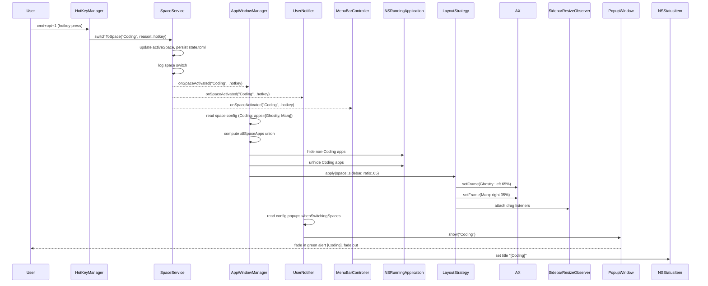
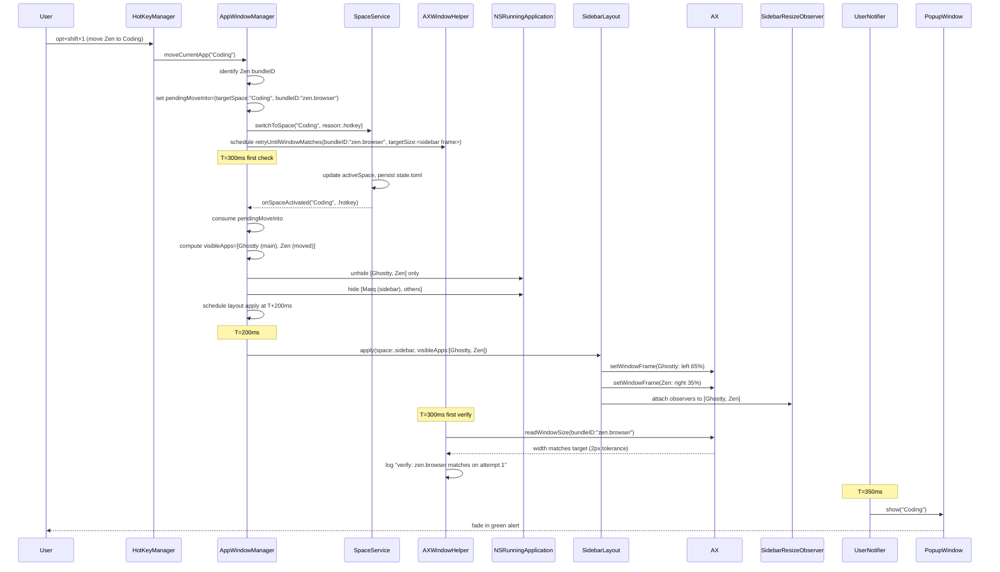
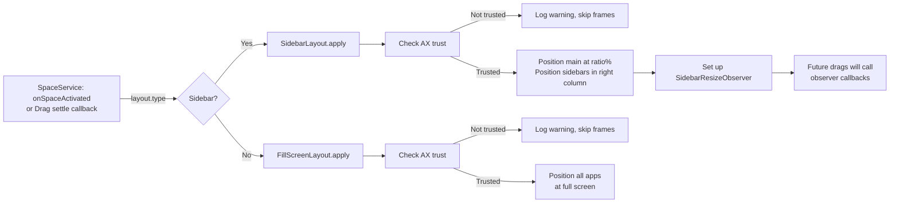
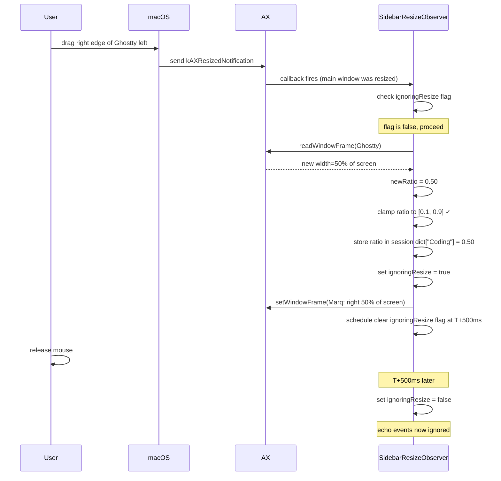

# App Architecture

Tilr is a native macOS workspace manager. It manages named "spaces" (Coding, Reference, Scratch, etc.), each with an associated list of apps. Activating a space hides all other apps, shows the space's apps, and optionally positions their windows via a layout strategy (sidebar or fill-screen). The app is driven by global hotkeys, CLI commands, and workspace activation events.

## Table of Contents

- [Overview](#overview)
- [User Actions & Sequences](#user-actions--sequences)
  - [Space switch (hotkey or CLI)](#space-switch-hotkey-or-cli)
  - [Move app to space](#move-app-to-space-hotkey-optshiftkey)
  - [Apply layout](#apply-layout-on-space-switch-resize-on-drag)
  - [Drag-to-resize sidebar](#drag-to-resize-sidebar-ax-observer-callback--layout-reapply)
  - [Hide/unhide apps on space switch](#hideunhide-apps-on-space-switch)
- [Components](#components)
- [Hammerspoon POC: API comparison](#hammerspoon-poc-api-comparison)
  - [Side-by-side API map](#side-by-side-api-map)
  - [Behavioural differences the native rewrite forced](#behavioural-differences-the-native-rewrite-forced)
  - [Implications for the current known bugs](#implications-for-the-current-known-bugs)
- [State & config](#state--config)
- [Known issues & open questions](#known-issues--open-questions)
- [Event channels](#event-channels)
- [Logger categories](#logger-categories)
- [Activation reasons](#activation-reasons)
- [Appendix: Move-window-to-space design](#appendix-move-window-to-space-design)
- [Appendix: macOS Windowing and Accessibility APIs](#appendix-macos-windowing-and-accessibility-apis)

## Overview

For context on macOS windowing and why we use the Accessibility Framework, see [Appendix: macOS Windowing and Accessibility APIs](#appendix-macos-windowing-and-accessibility-apis).


```
INPUT ADAPTERS (translate user actions → domain commands)
┌──────────────────┐                    ┌──────────────────┐
│  HotKeyManager   │                    │ CommandHandler   │
│  (Carbon events) │                    │  (socket / CLI)  │
└──────────────────┘                    └──────────────────┘
        │                                        │
        └────────────────┬─────────────────────┘
                         ▼
              Commands: switchToSpace,
              moveCurrentApp, applyConfig
                         │
┌─────────────────────────────────────────────────────────────────┐
│                      DOMAIN (SpaceService)                       │
│  Commands in → Events out. Owns state privately (via StateStore). │
│  No UI or window API knowledge.                                   │
└──────────────────────┬──────────────────────────────────────────┘
                       │
        ┌──────────────┴──────────────┐
        │ Events: onSpaceActivated,   │
        │ onNotification              │
        ▼                             ▼
   OUTPUT ADAPTERS (each does one job, subscribes to events)
┌──────────────────┐  ┌──────────────────┐  ┌──────────────────┐
│ AppWindowManager │  │  UserNotifier    │  │ MenuBarController│
│ (hide/show/      │  │  (popup window)  │  │ (menu bar title) │
│  layout)         │  │                  │  │                  │
└──────────────────┘  └──────────────────┘  └──────────────────┘
```

**Key invariants:**

1. **User config is read-only to the app.** Config lives at `~/.config/tilr/config.toml`; Tilr never writes to it. Runtime state (active space, sidebar ratios) goes to `~/Library/Application Support/tilr/state.toml`, which Tilr owns.
2. **All space changes funnel through `SpaceService`.** One code path, one log line, one event — whether triggered by hotkey, CLI, or startup.
3. **AX operations can race with hide/unhide.** When we hide an app, macOS makes its main AX window inaccessible — only dialogs remain. Windows are pre-resized before hiding to avoid inaccessibility on later cmd-tab. Post-unhide AX reads get a 200ms grace period.
4. **Sidebar drag-to-resize happens asynchronously.** Drags fire AX observer callbacks; layout reapplies on settle with a re-entrance guard to swallow echo events.

## User Actions & Sequences

### Space switch (hotkey or CLI)

**Problem:** User presses `cmd+opt+1` to switch to the "Coding" space. We must show its apps, hide others, position windows per layout, and notify the user.



**Steps & decision points:**

- **T=0:** Hotkey callback → `SpaceService.switchToSpace("Coding", reason:.hotkey)`. Service is `@MainActor`, blocking.
- **Sync path:** Service updates `activeSpace`, persists `state.toml` (async write to disk doesn't block event delivery), publishes `onSpaceActivated` event (broadcast).
- **AppWindowManager receives event:**
  - Looks up `ConfigStore.current.spaces["Coding"]`.
  - Computes all bundle IDs across all spaces (for determining what to hide).
  - Hides every app not in Coding; unhides Coding's apps.
  - Dispatches to layout strategy. For sidebar: main app (e.g. Ghostty) to 65% width left, sidebars (e.g. Marq) to 35% right.
  - Layout strategy sets up AX resize observers for the sidebar apps.
- **UserNotifier receives event:**
  - Reads `ConfigStore.current.popups.whenSwitchingSpaces`.
  - If true, shows popup. Popup is async (asyncAfter 0.35s) but doesn't block layout.
- **MenuBarController receives event:**
  - Updates menu bar title to `"[Coding]"`.
- **Why this order:** Layout applies before popup fires, so windows are positioned before the user sees the notification. If AX is not trusted, layout silently fails at `apply` time (logged as `.info`, not an error); hide/show still worked, so the space is functional.

---

### Move app to space (hotkey: opt+shift+<key>)

**Problem:** User holds Zen Browser (open in Reference space, fill-screen) and presses `opt+shift+1` to move it to Coding (sidebar layout). We must switch to Coding, show only Zen + Ghostty (main), hide Marq (sidebar), position Zen in the sidebar slot, and avoid flashing.



**Steps & decision points:**

- **`moveCurrentApp("Coding")` is sync:** Set `pendingMoveInto` before calling `service.switchToSpace`. This ensures the move information reaches `handleSpaceActivated` immediately (via workspace observer, also sync).
- **Why pre-announce the move:** If we don't set `pendingMoveInto` first, the layout will be computed with Zen already gone (space-switch logic wouldn't know about it), and it would re-show Marq. Instead, `pendingMoveInto` tells `handleSpaceActivated` to compute `visibleApps` as `[main, moved]` for sidebar, or just `[moved]` for fill-screen.
- **Hide before resize:** Apps are hidden *before* layout apply. This prevents flashing but creates a problem — if an app is hidden, its main AX window becomes inaccessible (macOS hides it). Solution: pre-resize all sidebar-slot apps *before* hiding them. When the user later cmd-tabs, the app unhides already at the correct size.
- **Verify-and-retry loop:** After layout apply, `retryUntilWindowMatches` polls Zen's width every 200ms (up to 4 attempts). Zen's internal window management fights AX calls for ~500–1000ms; the retry catches the snap-back and reapplies the layout. See `move-window-to-space-flow.md` for Zen-specific details.
- **Popup fires async:** It doesn't block anything; layout completes first.

---

### Apply layout (on space switch, resize on drag)

**Problem:** After a space switch or drag-to-resize, we must position windows and set up the AX resize observer. Apps may reject AX calls (sandboxed, full-screen, Zen fighting). Missing AX trust is expected and logged at `.info`; hide/show still works.



**Steps & decision points:**

- **Layout check AX trust at apply time, not at wiring time.** If trust changes at runtime (user denies permission in System Settings), the next layout apply gracefully downgrades to hide/show-only. This is expected; no error.
- **Sidebar logic:**
  - Read session ratio override dict first (keyed by space name). Fall back to `config.layout.ratio`. Fall back to `0.65`.
  - Position main app at `ratio * screenWidth` left, full height.
  - Stack all non-main apps in right column (`(1 - ratio) * screenWidth` wide, full height). They overlap — z-order is preserved.
  - Attach AX resize observers to both main and sidebar apps.
- **Fill-screen logic:**
  - Position all visible space apps to the full screen frame (they overlap).
  - No observers (no drag-to-resize for fill-screen in this delta).
- **Why observers after every apply:** We tear down the old observer set and create a new one scoped to the new visible apps in the new space. This prevents leaks and ensures drags only affect the current space's apps.

---

### Drag-to-resize sidebar (AX observer callback → layout reapply)

**Problem:** User drags the right edge of Ghostty (main, 65%) left to 50%. While dragging, we read the new position via AX, compute the new ratio, and re-tile Marq (sidebar). After the drag settles, we persist the ratio in the session dict.



**Steps & decision points:**

- **Observer fires on every resize, even our own.** To avoid re-entrance (observer calls setFrame → macOS fires another resize → observer calls setFrame again), we set `ignoringResize = true` before calling `setFrame`, then clear it after 500ms. This swallows the echo events the OS generates from our own moves.
- **Read new ratio from main window position.** `newRatio = mainWindow.width / screenWidth`. If main was dragged (our callback identified which window resized), compute ratio from main. If sidebar was dragged, compute from sidebar's `x` position.
- **Clamp to [0.1, 0.9].** Prevents pathological layouts (e.g. main 95%, sidebar 5% too narrow to be useful).
- **Session-only persistence.** Ratio goes into a memory dict keyed by space name. On app restart, ratios reset to config defaults. Persistent state (saving to `state.toml`) is Delta 9 work.
- **Why 500ms delay?** Empirical; matches Hammerspoon's pattern. Too short and echo events slip through; too long and drags feel sluggish. Tuned for Zen's settle time.

---

### Hide/unhide apps on space switch

**Problem:** When switching from Coding (Ghostty, Marq) to Reference (Safari, Zen), we must unhide Safari+Zen and hide Ghostty+Marq. Unhide is straightforward, but hide has a timing subtlety: if we hide an app after positioning it, its AX window becomes inaccessible, breaking future `setFrame` calls.

```mermaid
sequenceDiagram
    AppWindowManager->>AppWindowManager: determine thisSpaceApps (Ghostty, Marq)
    AppWindowManager->>NSRunningApplication: iterate all running apps
    
    alt App is in Coding
        AppWindowManager->>NSRunningApplication: app.unhide()
        Note over NSRunningApplication: unhide is async; AX<br/>readiness delayed ~200ms
    else App is not in Coding (e.g. Safari, Zen)
        AppWindowManager->>NSRunningApplication: app.hide()
    end
    
    Note over AppWindowManager: T=0ms hide/unhide complete (OS async)
    AppWindowManager->>LayoutStrategy: schedule layout apply at T+200ms
    Note over LayoutStrategy: T=200ms: AX unhidden apps<br/>are now accessible, safe to resize
```

**Steps & decision points:**

- **Unhide comes before position.** We unhide the target space's apps, then schedule the layout apply with a ~200ms delay. This gives macOS time to make the AX window accessible.
- **For `windowMove` operations only:** `handleAppActivation` (CMD+TAB) adds an extra 200ms delay before calling `setWindowFrame` if the target app was hidden at activation time. This is a workaround for the AX inaccessibility race; future work may replace it with an AX readiness poll.
- **Why pre-resize before hiding (for sidebar moves):** In the `windowMove` flow, sidebar-slot apps are resized *before* hiding them. When cmd-tabbed later, they unhide already at the correct size, so `handleAppActivation` doesn't need to re-size them (though it does, redundantly, for safety). See `move-window-to-space-flow.md` for details.

---

## Components

| Component | Responsibility | Key collaborators |
|---|---|---|
| **SpaceService** | Domain. Commands in (`switchToSpace`, `moveCurrentApp`, `applyConfig`), events out (`onSpaceActivated`, `onNotification`). Owns `StateStore` privately. `@MainActor`. | `ConfigStore` (read-only), `StateStore` (private), all output adaptors (subscribers). |
| **AppWindowManager** | Hide/show apps per space. Dispatches to layout strategies. Owns the long-lived `SidebarLayout` instance (so observer state survives space switches). Handles `handleAppActivation` for CMD+TAB sidebar-slot repositioning. | `ConfigStore`, `SidebarLayout`, `FillScreenLayout`, `NSRunningApplication`, AX. |
| **SidebarLayout** | Position main app at ratio% left, sidebar apps in right column. Own `SidebarResizeObserver`. Reads session ratio overrides before config defaults. | `SidebarResizeObserver`, AX APIs. |
| **FillScreenLayout** | Position all visible space apps to full screen (overlap). Stateless struct. | AX APIs. |
| **SidebarResizeObserver** | Own AX observer lifecycle for the current sidebar space. Store session ratio overrides. Re-entrance guard. | AX observer APIs. |
| **UserNotifier** | Show popup on space activation (policy: `config.popups.whenSwitchingSpaces`). Own `PopupWindow`. | `ConfigStore`, `PopupWindow`. |
| **MenuBarController** | Update menu bar title to `"[SpaceName]"` or `"Tilr"`. | `NSStatusItem`. |
| **HotKeyManager** | Register Carbon hotkeys from config. On press, call `SpaceService.switchToSpace` or `AppWindowManager.moveCurrentApp`. Re-register on config reload. | `ConfigStore`, `SpaceService`, `AppWindowManager`. |
| **CommandHandler** | Socket / CLI command dispatch. Routes to `SpaceService` or `ConfigStore`. | `SpaceService`, `ConfigStore`. |
| **ConfigStore** | Single source of truth for `TilrConfig`. `@Published current`. Hot-reload on demand. | Config file I/O. |
| **StateStore** | In-memory + `state.toml` persistence. Active space. Owned privately by `SpaceService`. | `state.toml` file I/O. |
| **PopupWindow** | Dumb view. No subscriptions, no config, no logging. Fade in → hold → fade out. | Pure NSPanel + SwiftUI. |

## Hammerspoon POC: API comparison

Tilr's behavioural reference implementation is a ~730-line Hammerspoon Lua script (`~/projects/dotfiles/home/hammerspoon/init.lua`). Most of Tilr's design choices — and most of its gotchas — make more sense when you see the Hammerspoon API we're porting from. The Lua POC uses a single-threaded Lua runtime riding on a shared Cocoa run loop, and `hs.*` APIs are thin wrappers around AppKit/AX/CoreGraphics that feel synchronous. The native rewrite is a full AppKit app with `@MainActor` boundaries, explicit AX observers, and SwiftUI views — which is why some HS idioms that "just work" in Lua become race-sensitive here.

### Hammerspoon architecture

Hammerspoon is a macOS automation framework. At its core it is a Lua runtime (LuaJIT) bundled with a large set of Lua bindings to macOS C/ObjC APIs. The `hs.*` modules are high-level Lua facades over low-level macOS primitives — `hs.window` wraps `AXUIElement`, `hs.application` wraps `NSRunningApplication` (plus some AX), `hs.hotkey.bind` wraps Carbon `RegisterEventHotKey` (same as our `HotKey` SPM library), `hs.screen` wraps `NSScreen`, `hs.alert` is a self-drawn `NSPanel` overlay (functionally identical to Tilr's `PopupWindow`), `hs.timer.doAfter` wraps `DispatchQueue.main.asyncAfter`, and `hs.window.filter` is a high-level multiplexed facade over raw `AXObserver` notifications. The Hammerspoon process hosts a Lua interpreter that runs on a Cocoa main-thread run loop; user scripts execute single-threaded relative to that loop.

Tilr is the structural inverse: a native Swift app that calls the same low-level macOS primitives directly, with no Lua wrapper layer.

```
Hammerspoon:
  Lua scripts (user code — init.lua)
      ↓
  hs.* Lua bindings (high-level synchronous-feeling APIs)
      ↓
  macOS C/ObjC (AXUIElement, NSRunningApplication, NSScreen,
                Carbon EventHotKey, CGEventTap, NSPanel, GCD, ...)

Tilr:
  Swift code (TilrApp + CLI)
      ↓
  Direct macOS C/ObjC (same low-level layer, no wrapper)
  — AXUIElementSetAttributeValue / AXObserverCreate
  — NSRunningApplication.hide() / unhide()
  — NSScreen.screens / NSScreen.main
  — Carbon RegisterEventHotKey (via HotKey SPM)
  — NSPanel + SwiftUI (PopupWindow)
  — DispatchQueue.main.asyncAfter
```

**Implication for timing bugs:** The `hs.*` wrapper layer absorbs many async/race details — a Lua script calling `win:setFrame(...)` sees a synchronous-feeling API even though the underlying AX call is asynchronous. The Lua run loop's single-threaded tick means HS never re-enters its own observer during a frame set. Tilr calls the low-level APIs directly on `@MainActor`, and its `AXObserver` callbacks fire on the same thread. Any race that HS hid behind its wrappers is fully visible in Tilr — which is the root cause of BUG-5 and BUG-6. The fix pattern is almost always to replicate what the HS wrapper did implicitly: defer re-entry, route through the normal space-switch path, or add an explicit settle timer.

### Side-by-side API map

| Capability | Hammerspoon API | Tilr equivalent | HS wrapper vs Tilr implementation |
|---|---|---|---|
| Running app lookup | `hs.application.get(bundleId)` (`init.lua:183, 256, 286, 316`) | `NSRunningApplication.runningApplications(withBundleIdentifier:)` (`AppWindowManager.swift`, `AXWindowHelper.swift`) | HS returns a rich wrapper object (Lua userdata) that bundles `mainWindow()`, `hide()`, `unhide()`, `bundleID()` behind a single call — it internally holds both an `NSRunningApplication` ref and an `AXUIElement`. Tilr splits these: `NSRunningApplication` for lifecycle, separate AX element for window geometry. |
| Enumerate running apps | `hs.application.runningApplications()` (`init.lua:187`) | `NSWorkspace.shared.runningApplications` (`AppWindowManager.swift:251`) | Direct equivalents — both enumerate the same system list. HS wraps each result as an `hs.application` Lua object. Tilr union-merges this with `allSpaceApps` from config to ensure configured-but-not-running apps don't leak through hide logic. |
| Focused window / frontmost app | `hs.window.focusedWindow()` (`init.lua:487, 529, 574`) | `NSWorkspace.shared.frontmostApplication` (`AppWindowManager.swift:63, 83`) | `hs.window.focusedWindow()` wraps `AXUIElementCopyAttributeValue(systemWide, kAXFocusedWindowAttribute)` and returns a wrapped `AXUIElement`. Tilr takes the higher path (`frontmostApplication`) then locates the window via `AXWindowFinder` — more steps but avoids a stale system-wide AX query. |
| Find an app's main window | `app:mainWindow()` (`init.lua:257, 270, 317, 333`) | `AXUIElementCopyAttributeValue(axApp, kAXMainWindowAttribute, …)` + fallback to `kAXWindowsAttribute` enumeration (`AXWindowFinder.swift:7, 18`) | HS `mainWindow()` wraps `kAXMainWindowAttribute` and returns the result as a single synchronous-looking call — it does not retry or fall back. Tilr must also check `kAXStandardWindowSubrole` and enumerate all windows when main is absent or non-standard (e.g. Marq). |
| Hide / unhide app | `app:hide()` / `app:unhide()` (`init.lua:184, 190, 643`) | `NSRunningApplication.hide()` / `unhide()` (`AXWindowHelper.swift:81, 83, 103, 105`) | Both reach the same `NSRunningApplication` AppKit call. HS appears synchronous because the single-threaded Lua loop doesn't re-enter its own AX observer during that tick. Tilr's AX observers fire concurrently, surfacing the race (BUG-5). |
| Activate app (bring to front) | Implicit via `app:activate()` or `openConsole` | `NSRunningApplication.activate(options: [])` (`AppWindowManager.swift:126, 306`) | `hs.application:activate()` wraps `NSRunningApplication.activate(options: .activateIgnoringOtherApps)`. Modern macOS largely ignores that flag; Tilr uses an empty options set, which is current best practice. |
| Window position / size (write) | `win:setFrame(frame, 0)` (`init.lua:217, 258, 266, 272`) | `AXUIElementSetAttributeValue(axWindow, kAXPositionAttribute, …)` + `kAXSizeAttribute` (`AXWindowHelper.swift:27, 45`) | `hs.window:setFrame` is a convenience wrapper that issues both `kAXSizeAttribute` and `kAXPositionAttribute` in one Lua call, in an internal order HS chose. Tilr calls them explicitly (Size then Position); a trailing Size-again call was removed because Zen snapped `x` back to 0. The ordering matters at the AX level. |
| Window position / size (read) | `win:frame()` (`init.lua:218, 251, 262, 489`) | `AXUIElementCopyAttributeValue` on `kAXPositionAttribute` + `kAXSizeAttribute` (`AXWindowHelper.swift:52, 53, 116`; `SidebarResizeObserver.swift:323, 324`) | Both issue the same AX read. HS checks delta post-write and warns (`init.lua:221`); Tilr has `retryUntilWindowMatches` with an explicit retry loop. Neither can guarantee the read value matches what was written (AX is fire-and-forget). |
| Verify-after-set pattern | Compute `delta` of requested vs actual, log warn if > 2 (`init.lua:219-225`) | `retryUntilWindowMatches(bundleID:targetSize:…)` — polling + re-apply (`AXWindowHelper.swift`) | HS logs and moves on — Lua's single-threaded tick means no app can fight back until the next user event. Tilr retries up to 4× because Zen Browser actively resets its own frame ~500–1000ms after the AX call. The HS wrapper's "synchronous feel" hid this race; Tilr has to handle it explicitly. |
| Move window to a given screen | `win:moveToScreen(screen, false, false, 0)` (`init.lua:216, 318`) | No equivalent yet `[VERIFY]` — multi-display not implemented; `NSScreen.main` everywhere | `hs.window:moveToScreen` wraps a sequence of AX position writes with coordinate remapping between display geometries. Tilr has no analogue; single-screen assumption is hardcoded throughout. Gap deferred. |
| Hotkey registration | `hs.hotkey.bind(mods, key, fn)` (`init.lua:518`) | `HotKey` library (`KeyCombo(key:modifiers:)` + `HotKey(keyCombo:)`, `HotKeyManager.swift:49, 50, 64, 65`) | Both ultimately wrap Carbon `RegisterEventHotKey`. The HS wrapper adds Lua callback management and conflict detection. The SPM `HotKey` library provides the same terse Swift API without the extra scaffolding. |
| Deferred timer | `hs.timer.doAfter(delay, fn)` (`init.lua:197, 278, 301, 347, 363, 549, 676`) | `DispatchQueue.main.asyncAfter(deadline: .now() + delay)` (throughout) | `hs.timer.doAfter` wraps `dispatch_after` on the main queue — exact same primitive. HS uses it to smooth over AX settle times (0.2s layout delay, 0.5s re-entrance guard); Tilr uses identical durations for identical reasons. The wrapper obscures that these are all async deferrals on one shared run loop. |
| App launch / activation watcher | `hs.application.watcher.new(fn)` with `.launched` / `.activated` events (`init.lua:357, 652`) | `NSWorkspace.shared.notificationCenter.addObserver(forName: NSWorkspace.didActivateApplicationNotification, …)` (`AppWindowManager.swift:41-42`) | `hs.application.watcher` wraps `NSWorkspace` notifications and delivers them as Lua callbacks with a unified event-type enum. Tilr subscribes to `NSWorkspace` notifications directly. HS's `.launched` trigger for late-launch layout re-apply has no Tilr equivalent yet. |
| Window move/resize observer | `hs.window.filter.new(false)` subscribing to `windowMoved` / `windowDestroyed` (`init.lua:292-294`) | `AXObserverCreate(pid, cb, …)` + `AXObserverAddNotification(observer, element, kAXResizedNotification, …)` + `CFRunLoopAddSource` (`SidebarResizeObserver.swift:285, 291, 297`) | `hs.window.filter` is a substantial abstraction: it multiplexes `AXObserver` notifications across all windows system-wide, filters by app name, and delivers unified events (windowMoved, windowDestroyed, windowCreated, etc.) as Lua callbacks. Tilr does this from scratch per app per window via raw `AXObserver` — which is why `SidebarResizeObserver` is substantial and why window-destroyed requires a separate explicit subscription. |
| Screen info | `hs.screen.allScreens()`, `hs.screen.primaryScreen()`, `screen:frame()`, `screen:id()`, `screen:getUUID()` (`init.lua:58, 152, 449, 452`) | `NSScreen.screens`, `NSScreen.main`, `screen.frame` (various layout files) | `hs.screen` wraps `NSScreen` with added helpers (`getUUID()`, `id()` returning a persistent integer). Tilr calls `NSScreen` directly; Tilr has a `displays` config section but screen-assignment logic is not yet wired up. |
| Screen connect/disconnect | `hs.screen.watcher.new(fn)` (`init.lua:680`) | Not implemented `[VERIFY]` | `hs.screen.watcher` wraps `NSScreenColorSpaceDidChangeNotification` / display-reconfiguration callbacks. Tilr has no equivalent. The HS version has direction-aware takeover logic (`handleScreenRemoved`, `init.lua:613`); Tilr does not yet reproduce it. |
| Space model (named, app-grouping "spaces") | Pure Lua data structure keyed by screenId (`activeSpace`, `init.lua:117`) | Pure Swift model in `StateStore` + `ConfigStore.current.spaces` (`SpaceService`) | **Neither uses native macOS Spaces, `hs.spaces`, or CGS private APIs.** Both model "spaces" as `{name → [bundleIDs]}` and implement activation as pure hide/unhide + layout. No yabai, no Mission Control integration. The HS module `hs.spaces` (which *can* use private SLS calls in other HS configs) is not used in this config at all. |
| Alert / HUD | `hs.alert.show(msg, ALERT_STYLE, duration)` (`init.lua:110`) | `PopupWindow` (`NSPanel` + SwiftUI `NSHostingView`, `PopupWindow.swift:53, 64`) | `hs.alert` is a self-drawn `NSPanel` overlay with its own CALayer-based fade animation — conceptually identical to Tilr's `PopupWindow`. Style parameters map directly: Menlo 30pt, `#00ff88` on `#1a1a2e`, fade 0.1s/hold 1.2s/fade 0.15s (`init.lua:94`). Tilr reproduces this in SwiftUI. |
| Config reload | `hs.reload()` — re-executes `init.lua` whole-program (`init.lua:704`) | `ConfigStore.reload()` → `@Published` re-publish → subscribers re-wire (see "Live config reload") | `hs.reload()` is nuclear — it tears down the entire Lua runtime (releasing all `hs.*` objects, observers, timers, watchers) and rebuilds from scratch. This is safe because HS objects have no persistent identity across reloads. Tilr does surgical re-wiring via `@Published`: only `HotKeyManager` re-registers hotkeys; other observers survive reload unchanged. |
| Session app/screen overrides | In-memory `sessionAppOverride` / `sessionScreenOverride` dicts cleared on reload (`init.lua:124-126, 538`) | `pendingMoveInto` is the closest analogue (move-into one-shot); persistent session overrides not implemented `[VERIFY]` | HS's session override dicts are cleared by `hs.reload()` — the nuclear reload is what makes this safe. Tilr's surgical reload means session state must be explicitly cleared or persisted. `pendingMoveInto` is a one-shot not a persistent dict; the full override model is deferred. |
| Re-entrance guard (ignore own resize callbacks) | `ignoringResize` flag cleared via `hs.timer.doAfter(0.5, …)` (`init.lua:278, 347`) | Same idea, same 500ms window (`SidebarResizeObserver.swift` — look for `ignoringResize`) | Tilr ports this pattern verbatim. The underlying OS echo behaviour (AX observer fires on our own `setFrame` calls) is identical in both runtimes. The 500ms window is empirically tuned in HS and reproduced unchanged. |

### Behavioural differences the native rewrite forced

1. **AX is racy where HS felt synchronous.** `hs.window:setFrame` issues one AX call and HS's `delta`-check (`init.lua:219-225`) logs a warning if it drifts. Because the Lua script doesn't touch AX again until the next user action, that's the end of the story. In Tilr, an AX observer on the same window may fire concurrently with our set, and apps like Zen fight the first few attempts. That's why Tilr has `retryUntilWindowMatches` and `pendingMoveInto` — neither has a direct HS analogue.
2. **Hide/unhide timing is the same, but Tilr's watchers see the echo.** HS also calls `app:hide()` before applying layout (`init.lua:190` → `doAfter(0.2)` at line 197), but the Lua script has no AX readiness concern afterward — it just sets frames 200ms later. Tilr's `handleAppActivation` path (CMD+TAB to a just-unhidden app) needs an extra 200ms guard because the AX main window isn't accessible immediately post-unhide. This is BUG-5.
3. **Move-into uses pre-resize-before-hide (Tilr) vs session-override-before-unhide (HS).** HS's move path (`moveFocusedAppToSpace`, `init.lua:528–560`) uses pure hide/unhide: it sets `sessionAppOverride[bundleId] = targetSpace` then calls `activateSpace` (the hide/show function), which consults the override during activation to ensure the moved app is unhidden (not hidden). Sidebar-slot apps *get their frame from the next `applyLayout` pass*, which runs after hide/unhide has settled. Tilr pre-resizes sidebar slots *before* hiding (to avoid AX inaccessibility later) — a workaround for a race HS didn't face because HS never hits `setFrame` on a hidden window. Tilr's `pendingMoveInto` is the equivalent of HS's `sessionAppOverride`, but only covered the sidebar-layout case; the fill-screen branch ignored it, causing BUG-6.
4. **No higher-level `hs.window.filter` equivalent.** HS's filter multiplexes `windowMoved`, `windowDestroyed`, app filters, etc. Tilr rebuilds this from `AXObserverAddNotification` per-app per-window. Any new event type (e.g. window-destroyed to re-apply layout, `init.lua:294`) has to be added manually to `SidebarResizeObserver`.
5. **Reload is surgical, not nuclear.** HS's `hs.reload()` blows up everything (observers, watchers, timers) and rebuilds from scratch. Tilr's `ConfigStore.reload()` publishes to subscribers who individually decide what to re-wire. This is cleaner but means individual adaptors (e.g. `SidebarResizeObserver`) must handle config changes without full re-init.
6. **Neither uses private CGS/Spaces APIs.** Both the HS POC and Tilr implement "spaces" entirely at the app visibility layer — no Mission Control, no `SLSManagedDisplayGetCurrentSpace`. This is an explicit design choice (specifications.md §3: "Hide/unhide model"). Worth knowing because it rules out certain approaches (e.g. native space-per-display) and explains why window management is so AX-heavy.

### Implications for the current known bugs

- **BUG-6 (fill-screen move flash):** In HS's fill-screen move path (`init.lua:548–557`), the app is moved to the target space via `activateSpace` (which consults `sessionAppOverride` to unhide the moved app, then hides competitors), then at T+350ms `placeWindow` resizes the moved app to `targetScreen:frame()`. Because HS's move uses the session override mechanism (pre-activation override dict, identical to Tilr's `pendingMoveInto`), the moved app is unhidden as part of the normal space-switch path. Tilr's fill-screen move path hides competitors and applies the fill-screen frame, but the fill-screen branch was ignoring `pendingMoveInto`, so the moved app wasn't being tracked in `visibleApps`. This caused the moved app to briefly show at full screen before being hidden again. **Root cause:** fill-screen `OperationType.windowMove` branch didn't use `pendingMoveInto` like the sidebar branch did. **Fix:** set `fillScreenLastApp[targetName] = bundleID` before the space switch (equivalent to HS's `sessionAppOverride` pattern), so the fill-screen branch includes the moved app in its visibility/layout computation.
- **BUG-5 (CMD+TAB sidebar handoff lag):** HS does not have this bug because it never calls `setFrame` from inside an activation handler — its `focusWatcher` (`init.lua:652`) only calls `activateSpace`, which goes through the normal 200ms deferred layout path. Tilr's `handleAppActivation` directly resizes the activated sidebar-slot app, which requires its own 200ms AX-readiness delay. Options: (a) make CMD+TAB go through the full `activateSpace` path (HS's approach, costs a full re-apply), or (b) poll for AX readiness instead of a fixed 200ms wait.
- **General intuition:** Whenever Tilr hits a timing bug that HS doesn't have, the culprit is usually that HS leaned on *the next tick of the Lua run loop* to smooth over AX races, while Tilr has explicit observers firing on the same main actor and can't. HS uses the same hide/unhide + layout approach as Tilr (no private CGS APIs); it just relies on the Lua interpreter's single-threaded tick ordering to avoid observer re-entrance. The fix pattern is almost always either: add a small deferred re-apply, replicate HS's pre-activation override pattern (like `pendingMoveInto`), or route through the normal space-switch path instead of touching AX directly.

## State & config

**Two-file model (never mixed):**

- **`~/.config/tilr/config.toml`** (user-owned, read-only to app)
  - Spaces, apps per space, layout type/ratio, hotkey modifiers, popup policy, display defaults.
  - Read on app launch and on explicit `tilr reload-config` CLI command.
  - `ConfigStore.current` is `@Published`; subscribers react to changes automatically.
  - Edited by user (text editor) or CLI commands (`tilr spaces add`, etc.) but not the app itself.

- **`~/Library/Application Support/tilr/state.toml`** (app-owned, written by app only)
  - Active space name. Session-only ratio overrides (sidebar drag-to-resize). Future: per-display active space.
  - Persisted on every space switch via `SpaceService`.
  - Restored on app launch to resume the user's previous context.

**Read/write timing:**

| Operation | File(s) | Blocking? |
|---|---|---|
| App launch | config.toml → ConfigStore.current | blocking; log if malformed |
| App launch | state.toml → StateStore (optional; missing file is OK) | blocking async |
| Hotkey press | config (via ConfigStore.current, already in memory) | non-blocking |
| Space switch | state.toml write | async (non-blocking) |
| Drag-to-resize | session ratio dict (memory only) | non-blocking |
| `tilr reload-config` | config.toml reload → ConfigStore.current re-publish | async; HotKeyManager re-registers on change |

## Fixes & optimizations

### BUG-6 fix: Fill-screen move flash (2026-04-25)

**Problem:** Moving Marq to Reference (fill-screen space) briefly flashed the app full-screen then hid all windows.

**Root cause:** The fill-screen `OperationType.windowMove` branch ignored `pendingMoveInto`, the move-override flag set before space switch. This caused `handleSpaceActivated` to compute `visibleApps = [moved]` (only the moved app), hide all competitors, but then the fill-screen layout didn't include the moved app in its final positioning because it wasn't being tracked. The app briefly rendered at full screen before being hidden by competitor-hide logic.

**Fix:** Set `fillScreenLastApp[targetName] = bundleID` before calling `switchToSpace` (equivalent to HS's `sessionAppOverride` pattern). This ensures the fill-screen branch's `handleSpaceActivated` path includes the moved app in `visibleApps` computation. Also wired `retryUntilWindowMatches` in the fill-screen path to verify window sizing post-layout.

**Related fix:** Hotkey re-registration guard — was subscribing to all config changes, now only on hotkey/space name/ID changes. Reduces spurious re-registrations and avoids lost hotkeys during unrelated config reloads.

---

### FillScreenLayout optimization: Only frame visible apps (2026-04-25)

**Problem:** Layout applied AX frames to all running apps in a space, including hidden ones, generating unnecessary AX calls and risking frames on inaccessible windows.

**Solution:** Filter `space.apps` to only visible apps before positioning: `.contains { !$0.isHidden }`. Reduces AX call volume and avoids framing hidden apps (which are inaccessible post-hide and would fail silently anyway).

**Code location:** `FillScreenLayout.swift`, `.spaceSwitch` case — pre-filter to `visibleApps` before calling `setWindowFrame`.

---

### retryUntilWindowMatches aggressive tuning (2026-04-25)

**Initial problem:** Windows were resizing slowly or not at all when apps like Zen Browser internally fought AX calls for 500–1000ms. The initial fixed-delay approach (300ms check, up to 4 retries) caught the problem but felt sluggish.

**Tuning experiment:** Tested aggressive early checks with variable retry intervals to catch fast-settling apps immediately while still covering slow apps.

**Final schedule:** 10ms initial check, then retries at [20ms, 50ms, 100ms, 200ms, 200ms, 200ms, 200ms].

| Attempt | Delay | Cumulative | Notes |
|---------|-------|------------|-------|
| 1 (initial) | 10ms | 10ms | Fast apps caught almost immediately |
| 2 | 20ms | 30ms | |
| 3 | 50ms | 80ms | Most apps settled by here |
| 4 | 100ms | 180ms | Covers medium-speed apps |
| 5–8 (retries) | 200ms each | ~980ms | Covers Zen's 500–1000ms window settle time |

**Total budget:** ~980ms, still under Zen's typical window settling time of ~360ms + safety buffer.

**Results:** Windows resize "almost instant" without flakiness; early 10ms–100ms attempts catch fast-settling apps immediately, while later 200ms retries handle Zen's fighting behaviour. No observed failures; feels snappiest at 10ms vs earlier 300ms threshold.

**Threshold history:** Started at 300ms → 100ms → 50ms → 20ms → 10ms. Empirical testing confirmed 10ms is optimal for responsiveness without introducing races.

---

## Known issues & open questions

**Cross-references to `plan.md`:**

- **BUG-5:** CMD+TAB sidebar handoff has ~200ms animation lag. After unhiding a sidebar-slot app, we add a 200ms delay before calling `setWindowFrame` to wait for AX readiness. Future: replace with AX readiness poll instead of fixed timing.

**Open questions:**

- Multi-display support: Currently `NSScreen.main`. Config has a `displays` section with per-display default space, but app logic doesn't use it yet.
- Persistent sidebar ratios: Drag-to-resize ratios are session-only (memory dict). Delta 9 will persist to `state.toml`.
- App-launch watcher: If a space app launches after a switch, layout isn't re-applied. Works because apps inherit the space's frame when unhidden. Future: hook `NSWorkspace.didLaunchApplicationNotification` to re-apply layout if needed.

## Event channels

**`SpaceService` publishes two distinct event types:**

- **`onSpaceActivated(name, reason)`** — A real configured space is now active. Internal state updated and persisted. All three output adaptors may react:
  - `AppWindowManager`: hides/shows apps, applies layout
  - `UserNotifier`: shows popup per reason and config policy
  - `MenuBarController`: updates menu bar title
  
- **`onNotification(message)`** — Transient message with no state change (e.g. `"↺ Config"` when reload has no default space to activate). Only `UserNotifier` reacts. Windows and state untouched.

This separation guarantees `activeSpace` only ever holds real space names (never UI strings), and layout never re-arranges windows for a non-activation.

## Logger categories

| Category | Scope |
|---|---|
| `Logger.app` | Lifecycle (launch, terminate, signal handling). |
| `Logger.space` | **All space-change logging** — activation, CLI moves, config apply. One line per event. |
| `Logger.config` | Config loading / reload and parse errors. |
| `Logger.state` | State file I/O and parse errors. |
| `Logger.hotkey` | Hotkey registration, parse errors. No per-press logging. |
| `Logger.menuBar` | Menu bar title updates. |
| `Logger.socket` | Socket server lifecycle and command dispatch. |
| `Logger.windows` | Hide/show of apps and layout application (sidebar, fill-screen). Positioning errors logged here. Resize observer activity (drag settle). |
| `Logger.layout` | Layout strategy `apply()` start, positioning, AX trust state. |

## Activation reasons

Every space change carries a reason (for observability and policy):

```swift
enum ActivationReason {
    case hotkey         // user pressed a key
    case cli            // user ran `tilr switch`
    case configReload   // `tilr reload-config` or config file changed
    case startup        // app launched
}
```

**Policy:** `UserNotifier` uses reason to decide popup visibility:

| Reason | Popup shown? |
|---|---|
| `.hotkey` | if `config.popups.whenSwitchingSpaces` |
| `.cli` | if `config.popups.whenSwitchingSpaces` |
| `.configReload` | always |
| `.startup` | always |

Hotkey and CLI are grouped (both user-initiated space selection); `configReload` and startup are grouped (system events that may be surprising). If a new input source is added later, its popup policy is decided by grouping it with an existing reason or creating a new one.

---

## Appendix: Move-window-to-space design

See `move-window-to-space-flow.md` for a deep dive on the apply-and-verify pattern, why Zen Browser needs retries, and the specific AX call ordering that works around its internal window management.

**TL;DR:**
- `OperationType.windowMove` semantics differ from `.spaceSwitch`: hide competitors *before* resizing to avoid flashing.
- Sidebar-slot apps are pre-resized *before* hiding (avoiding AX inaccessibility on later cmd-tab).
- `retryUntilWindowMatches` polls window width (not height — menu bar clamps height) and reapplies layout if it drifts. Zen fights AX for ~500–1000ms; we retry up to 4 times (typical settle in 1–2).
- Comparison is width-only within 2px tolerance.

## Appendix: macOS Windowing and Accessibility APIs

### How macOS windowing works

macOS presents windows to users via Mission Control (virtual desktops called "spaces"). Internally:

- **NSWindow** — AppKit's representation of an OS window. Each window has a frame (x, y, width, height), belongs to exactly one app, and can be hidden/shown via `NSWindow.isVisible` or `NSRunningApplication.hide()`/`unhide()`.
- **Space (Mission Control)** — A virtual desktop that can hold any subset of windows from any app. Switching spaces shows/hides windows, but the underlying windows remain intact (hidden, not destroyed).
- **Focus** — Only one app is "frontmost" at a time (accessible via `NSWorkspace.shared.frontmostApplication`). Focusing an app brings all its windows forward, but macOS can show windows from multiple apps if they span spaces or are on different displays.

Tilr's design assumption: **We do not use native macOS Spaces or Mission Control APIs.** Instead, we model "spaces" as named app groupings and implement activation via hide/unhide (NSRunningApplication) plus optional window positioning (AX). This is identical to the Hammerspoon POC and keeps the system simple and cross-compatible.

### What the Accessibility Framework (AX) is

The Accessibility Framework (AXUIElement) is macOS's public API for querying and controlling UI elements on behalf of users with disabilities. For window management:

- **AXUIElement** — Opaque handle to an inspectable/controllable UI element (app, window, button, etc.). Retrieved via `AXUIElementCreateApplication(pid)` (app-level) or enumeration from an app.
- **Attributes** — Properties readable/writable via `AXUIElementCopyAttributeValue(element, attrName)` and `AXUIElementSetAttributeValue(element, attrName, value)`. For windows: `kAXPositionAttribute` (x, y), `kAXSizeAttribute` (width, height), `kAXMainWindowAttribute` (focus), `kAXWindowsAttribute` (all windows).
- **Notifications** — Observable events published when an element changes. For windows: `kAXResizedNotification`, `kAXMovedNotification`, `kAXUIElementDestroyedNotification`. Subscribe via `AXObserverCreate(pid, callback, ...)` + `AXObserverAddNotification(...)` + `CFRunLoopAddSource(...)`.

Tilr uses AX to:
1. Find an app's main window (Hammerspoon's `app:mainWindow()` equivalent via `contentWindow(forApp:bundleID:)`).
2. Read/write window positions and sizes for layout.
3. Observe resize events to implement drag-to-resize (`SidebarResizeObserver`).

**Why Tilr needs AX:** macOS's public AppKit (`NSWindow`) gives us the list of windows but no "move app to space" primitive. NSRunningApplication gives us hide/unhide (which controls visibility across spaces) but no direct frame manipulation. AX is the only public API that lets us position windows. (Private alternatives: CGS, hs.spaces, yabai.)

### Why Tilr uses AX

macOS does not expose a high-level `moveAppToSpace(app, space)` or `setWindowPosition(window, x, y)` API. To implement workspace management:

- **Hide/unhide is not enough:** It controls which apps are visible in the active space, but leaves windows positioned however the app last left them. If the user switches from Coding (small sidebar) to Reference (full-screen Zen), switching back to Coding would show Zen full-screen instead of sidebar-sized.
- **AX is the workaround:** We hide all non-current-space apps (losing their visibility), unhide current-space apps (restoring them), and use AX `setWindowFrame` to reposition them per the layout strategy (sidebar 65% / 35%, or full-screen).
- **Private API trade-offs:**
  - **CGS (Core Graphics Server)** — Low-level private API used by yabai for true space assignment. Would avoid hide/unhide entirely but is fragile (subject to change, no API contract).
  - **hs.spaces (Hammerspoon's space module)** — Wraps private SLS calls to query space state. Tilr doesn't use it; we model spaces as pure app groupings.
  - **yabai** — Tiling window manager using CGS for true space + window assignment. Incompatible with Tilr's design (Tilr is minimal, yabai is opinionated about layout).

Tilr's choice: **public AX** is more stable than CGS, simpler than true space APIs (which require integrating with Mission Control), and sufficient for the hide/unhide + frame-set model.

### Known gotchas with AX

1. **Async reads** — `AXUIElementCopyAttributeValue` returns `kAXErrorCannotComplete` if the app is busy. Tilr logs and retries.
2. **Inaccessible windows when hidden** — When an app is hidden via `NSRunningApplication.hide()`, its main AX window becomes inaccessible; only modal dialogs remain. Workaround: pre-resize sidebar-slot apps *before* hiding them, so they're already positioned when later unhidden. See `move-window-to-space-flow.md` for details.
3. **AX observer races with app state** — When Tilr calls `setWindowFrame` and the observer fires concurrently, the app may ignore the frame or respond slowly (Zen Browser is the worst case, fighting AX calls for ~500–1000ms). Workaround: `retryUntilWindowMatches` polling loop to verify the frame was applied and re-apply if needed.
4. **Some apps don't expose main windows** — Apps like Marq return non-standard AX window attributes. Tilr's `AXWindowFinder` falls back to enumerating all windows and checking subrol; if all else fails, logging.info is issued (no error — the space is still functional, just without layout).
5. **Permission model** — User must grant "Accessibility" permission to Tilr in System Settings > Privacy & Security. Without it, AX calls fail silently and layout is skipped (hide/show still works). Tilr checks `AXIsProcessTrusted()` at apply time, logs `.info`, and degrades gracefully.

This is the root cause of bugs like BUG-5 (CMD+TAB sidebar handoff lag) and BUG-6 (fill-screen move flash) — both involve timing and observer/state races that don't occur in single-threaded Lua (Hammerspoon's POC) but surface in Tilr's multi-threaded `@MainActor` world with explicit observers.
