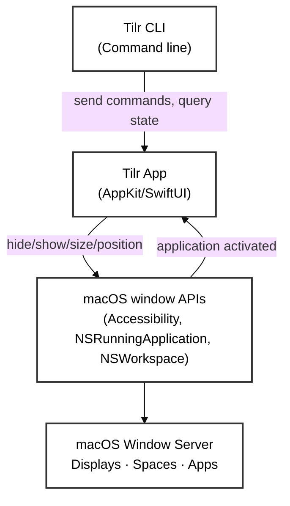
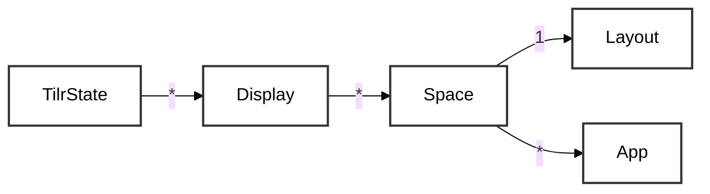
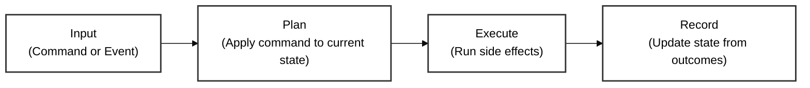

# Tilr Architecture v2 — Event-Driven State Model

> **Status:** Architectural design phase. This document evolves as we flesh out the model.
> Reference: `doc/arch/layout-flows.md`, `doc/bugs/bug-9-investigation-log.md`

## Table of Contents

1. [Context Diagram](#context-diagram)
2. [macOS APIs](#macos-apis)
3. [Domain Model](#domain-model)
4. [Commands and Events](#commands-and-events)
5. [Key Insights Captured](#key-insights-captured)
6. [Open Questions](#open-questions-for-next-iteration)

---

## Context Diagram



**Key relationships:**
- **Tilr App** owns the state model and responds to hotkeys, menu actions, workspace events
- **Tilr CLI** sends commands to Tilr App via IPC (socket) — same effect as user hotkey
- **macOS** returns window/app state via AX queries and sends notifications (focus changes, space changes, app launches)

---

## macOS APIs

Tilr interacts with macOS through a set of system frameworks. See [`doc/arch/macos-windowing.md`](macos-windowing.md) for detailed API reference.

**Key APIs:**

- **NSRunningApplication** — Hide/unhide apps, check visibility state, activate apps
- **NSWorkspace** — Observe workspace notifications (app focus, app launch/terminate, space changes)
- **Accessibility Framework (AX)** — Query window geometry, set window frames, enumerate windows, control app visibility via SystemEvents
- **NSScreen** — Query physical/virtual displays and their properties

**Why multiple APIs:**
- NSRunningApplication is the *only* public API for hide/unhide operations
- AX is required for window positioning (NSWindow is inaccessible from background processes)
- NSWorkspace provides event notifications that NSRunningApplication lacks
- No single API covers all our needs; we compose them

---

## Domain Model

Tilr's internal state is a hierarchical structure initialized on startup and updated by events:

### Hierarchy Overview



### Core Types

```swift
// Root state: all displays and their spaces
struct TilrState {
    displays: [Display]
    // Future: user config, layout preferences, etc.
}

// A physical display (monitor)
struct Display {
    id: String              // UUID or name
    name: String            // "Built-in Retina Display"
    spaces: [Space]         // Spaces currently resident on this display
    activeSpace: String?    // Name of active space on this display (e.g., "Coding")
}

// A single workspace/Mission Control space
struct Space {
    name: String            // "Coding", "Reference", "Scratch" (unique identifier)
    layout: Layout          // e.g., SidebarLayout, FillScreenLayout (Layout is immutable per space)
    apps: [App]             // Apps in this space
    displayId: String       // Which display this space currently occupies
    // Constraint: a Space can only be on ONE display at a time
}

// An application instance and its visibility state
struct App {
    bundleId: String        // e.g., "com.zen-browser.zen"
    displayState: AppDisplayState  // VISIBLE or HIDDEN
}

enum AppDisplayState {
    case visible
    case hidden
}

// Layout strategy for a space
enum Layout {
    case fillScreen(app: String)
    case sidebar(primary: String, secondary: [String])
    case custom(rules: [LayoutRule])
}
```

### State Lifecycle (Input → Plan → Execute → Record)



```
App Startup
  └─ Initialize TilrState from config (observes current OS state)
     ├─ Enumerate physical displays (NSScreen)
     └─ Load app membership from config and running processes

Event Loop (runs continuously)
  ├─ Receive Input (Command or OS Event)
  │  ├─ Commands: user hotkey, CLI arg, menu action
  │  │  • Encapsulated as Command objects (e.g., SwitchSpaceCommand("Coding"))
  │  │  • Carry semantic intent ("user wants to switch")
  │  │
  │  └─ Events: OS-generated notifications
  │     • App focus change (CMD+TAB) → auto-switch to app's space
  │     • App launch → add to app registry
  │     • App termination → remove from registry
  │     • App hidden/shown → auto-switch to app's space if shown
  │
  ├─ Generate ExecutionPlan (pure function)
  │  └─ plan = computePlan(currentState, command)
  │     • Plans are generated *structurally from command intent*, not via state diffing
  │     • SwitchSpaceCommand("Coding") → [HideApp(...), ShowApp(...), ...]
  │     • ShowAppCommand("zen") → [ShowApp("zen"), FocusApp("zen")]
  │     • Each action in the plan encodes what to do and expected outcome
  │
  ├─ Execute Plan (side effects boundary)
  │  └─ outcomes = executePlan(plan)
  │     • Phase 1: Issue all hide/show operations (batch, fire-and-forget)
  │     • Phase 2: Wait for AX stability (poll until consistent)
  │     • Phase 3: Apply layout (position windows)
  │     • Return [ActionOutcome] — what actually succeeded/failed
  │
  └─ Record State (pure function)
     └─ newState = updateState(currentState, plan, outcomes)
        • State is updated *after* execution, reflecting what AX confirmed
        • Events: track what changed (app launched → add to running list)
        • Commands: state mirrors the executed plan's outcomes
        • If execution partially failed, state reflects partial reality
```

**Key design principles:**
- **Intent flows through to execution:** Commands carry semantic meaning through plan generation, never flattened to state
- **Plans are structural, not derived:** Generated from command variants, not by diffing old/new state
- **Trailing state matches reality:** State is recorded after execution, so it reflects what AX actually did (crucial given AX's unreliability)
- **Outcomes verify execution:** Plans return `[ActionOutcome]`, state update consumes those outcomes
- **Testability:** Plans, execution, and state updates are all independently testable; intent is never lost

### Pipeline Architecture

The system operates as a **strict sequential pipeline**. Each input (Command or Event) flows through all phases before the next input enters:

```
Input Queue
   │
   ├─ Input N (Command/Event)
   ├─ Input N+1
   ├─ Input N+2
   └─ (future inputs wait here)
   │
   ▼
┌─────────────────────────────────────────────┐
│ PHASE 1: PLAN GENERATION                    │
│ computePlan(currentState, command)          │
│ → ExecutionPlan                             │
│ (pure function, generates from intent)      │
└────────────┬────────────────────────────────┘
             │
             │ ExecutionPlan
             ▼
┌─────────────────────────────────────────────┐
│ PHASE 2: EXECUTION                          │
│ outcomes = executePlan(plan)                │
│ • Issue hide/show (batch, fire-and-forget)  │
│ • Wait for AX stability (poll till stable)  │
│ • Apply layout (position windows)           │
│ → [ActionOutcome] (what succeeded/failed)   │
└────────────┬────────────────────────────────┘
             │
             │ outcomes, plan
             ▼
┌─────────────────────────────────────────────┐
│ PHASE 3: RECORD STATE                       │
│ newState = updateState(currentState, plan,  │
│                        outcomes)            │
│ • State reflects what AX confirmed          │
│ • Handles Events: update from OS reality    │
│ → newState (trailing record of reality)     │
└────────────┬────────────────────────────────┘
             │
             │ newState persisted
             ▼
          [READY FOR NEXT INPUT]
```

**Critical constraint:** The next input does NOT enter PHASE 1 until the current input has completed PHASE 3 (record state). This ensures:
- Intent is never lost: commands carry meaning through all three phases
- State consistency: only one transition at a time
- Reality match: state reflects what AX actually achieved, not what was predicted
- Deterministic ordering: event sequence is preserved
- AX stability: we wait for stability and verify outcomes before the next input

---

## Commands and Events

### Commands (User-initiated actions)

Commands are encapsulated objects representing intentional user actions. They encode semantic intent (not state transitions). They come from three sources:

```swift
protocol Command {
    // Commands don't produce state; they carry the intent for plan generation
    let intent: String  // e.g., "switch to space", "show app"
}

// Examples:
struct SwitchSpaceCommand: Command {
    let spaceName: String
    // "Switch to Coding space"
}

struct ShowAppCommand: Command {
    let bundleId: String
    // "Make Zen visible in current space"
}

struct HideAppCommand: Command {
    let bundleId: String
    // "Hide Zen"
}

struct MoveAppCommand: Command {
    let bundleId: String
    let toSpace: String
    // "Move Xcode to Reference space"
}

struct MoveSpaceCommand: Command {
    let spaceName: String
    let toDisplay: String
    // "Move Coding space from Display 1 to Display 2"
}
```

**Command sources:**
- **Hotkeys:** User presses `cmd+opt+c` → `SwitchSpaceCommand("Coding")`
- **CLI:** `tilr space switch coding` → `SwitchSpaceCommand("Coding")`
- **Menu bar:** (Future) user clicks menu → command object
- **All commands route through the same state update path**

### Events (OS-generated notifications)

Events are observations from the macOS system that update our internal model:

```swift
protocol OSEvent {
    func updateState(state: TilrState) -> TilrState
}

// Examples:
struct AppFocusedEvent: OSEvent {
    let bundleId: String
    // "User CMD+TAB'd to this app; it's now in focus"
}

struct AppLaunchedEvent: OSEvent {
    let bundleId: String
    let pid: Int
    // "New app process started"
}

struct AppTerminatedEvent: OSEvent {
    let bundleId: String
    let pid: Int
    // "App process exited"
}

struct AppHiddenEvent: OSEvent {
    let bundleId: String
    // "App was hidden"
}

struct AppShownEvent: OSEvent {
    let bundleId: String
    // "App was shown"
}

struct WindowClosedEvent: OSEvent {
    let bundleId: String
    let windowId: Int
    // "A window was closed"
}
```

**Event sources:**
- `NSWorkspace.shared` notifications (app launch, terminate, focus, hide, show)
- Window server observations (via Notification Center)

### ActionOutcome (Execution Results)

Execution returns outcomes for each action in the plan, so state update can record what actually succeeded:

```swift
enum ActionOutcome {
    case succeeded(action: String)        // e.g., HideApp("zen")
    case failed(action: String, error: String)
    case timeout(action: String)          // AX didn't respond
}
```

State update uses these outcomes to construct a trailing state that reflects reality:
- If `HideApp("zen")` succeeded, mark app as hidden
- If it timed out, leave state reflecting what we know (app may or may not be hidden)
- Events are recorded regardless of command success (app launched even if show-on-launch failed)

---

## Key Insights Captured

**Intent preservation (resolved):**
- Commands carry semantic intent ("user wants to switch space"), not just state deltas
- Previous approach: command → predict new state → diff to derive plan (intent lost at state level)
- New approach: command → plan (structural generation from command variant) → execute → record outcomes
- Plans are generated from command *intent*, not from diffing old/new state
- This eliminates information loss and keeps failure modes distinct (e.g., user-initiated hide vs space-change hide)

**Sequencing & conflict resolution (resolved):**
- Events from the OS naturally occur in a sequence; simultaneous events are rare enough to ignore
- Solution: queue all inputs (Commands and Events) and process them sequentially through the pipeline
- Each input must complete all three phases before the next input begins
- This prevents state inconsistency and race conditions between phase boundaries

**Trailing state matches reality (resolved):**
- State is a *record* of what AX confirmed, not a *prediction* of what will happen
- Previous approach: compute new state → execute → hope reality matches
- New approach: execute → collect outcomes → update state to reflect what succeeded
- Crucial for AX unreliability (Zen hide, fullscreen toggles, spaces without focus): state never drifts from observed reality

---

## Open Questions for Next Iteration

1. **State initialization:** How do we discover which apps belong to which spaces? Load from config file, enumerate running apps, or both?

2. **Space enumeration:** How do we map macOS Mission Control spaces to our named spaces (Coding, Reference, etc.)? Space ID → user config name mapping?

3. **App identity:** Is `bundleId` alone sufficient, or do we need PID for multi-instance apps (e.g., two Xcode windows)?

4. **Plan structure:** What should `ExecutionPlan` contain? 
   - `struct ExecutionPlan { hideApps: [String], showApps: [String], layoutFrames: [String: NSRect] }`?
   - Or more structured with phases?

5. **Layout engine:** How is the `Layout` enum converted to concrete `[String: NSRect]` frames? Separate layout module?

6. **AX state sync:** When do we refresh running apps from AX? On every event, periodically, or only when visibility changes?

7. **Input sources:** Besides hotkeys and CLI, should menu bar actions also generate Commands? What about drag-and-drop?

---

## Related Documents

- `doc/arch/layout-flows.md` — Proposed visibility orchestration phases
- `doc/arch/window-visibility.md` — Hide/show mechanics and app-specific quirks
- `doc/bugs/bug-9-investigation-log.md` — Zen hide issue and current workarounds
